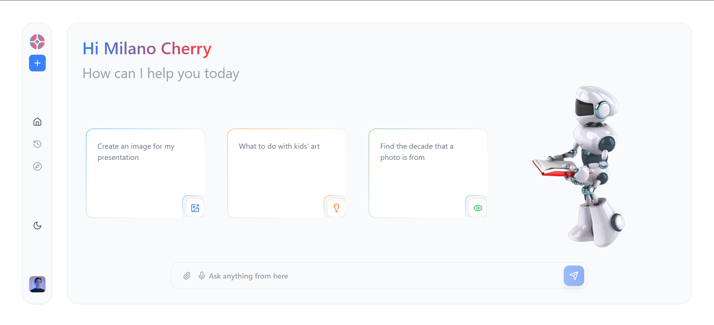
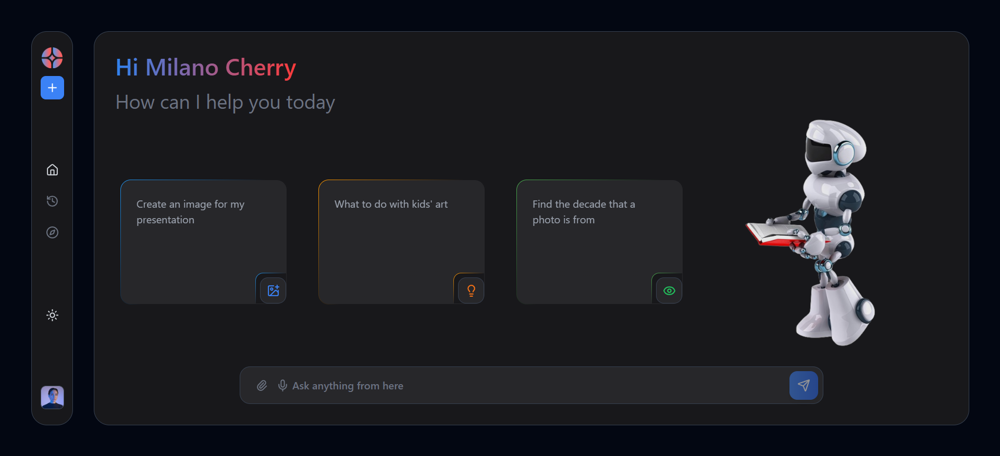
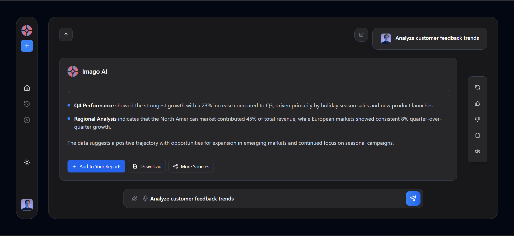
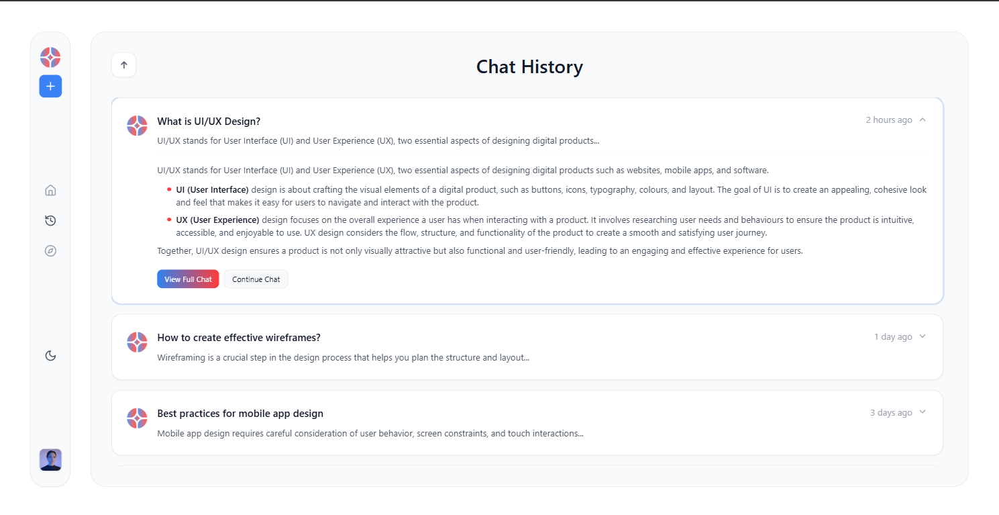
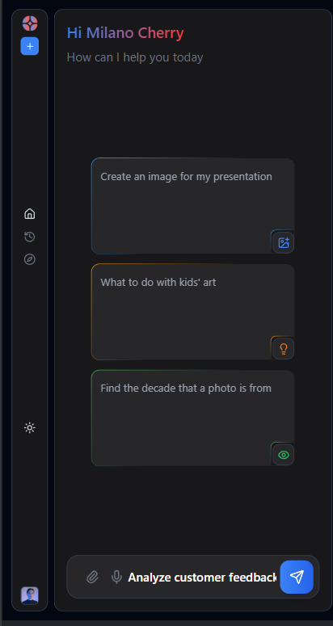
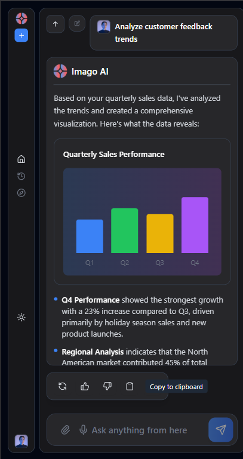

# Chat Application Task by Imago AI

A modern Frontend, responsive chat interface built with React and styled with Tailwind CSS. This application features a clean design with dark/light mode support, file attachments, and an intuitive conversation history system.

##  Features

- **Responsive Design**: Optimized for desktop, tablet, and mobile devices
- **Dark/Light Mode**: Toggle between dark and light themes
- **File Attachments**: Support for file uploads with visual indicators
- **Chat History**: View and continue previous conversations
- **Suggestion Cards**: Quick-start prompts for common queries
- **Real-time Input**: Dynamic input with suggestions and smooth animations
- **Modern UI**: Clean, gradient-accented interface with smooth transitions

##  Screenshots

Light Mode Dashboard
<div align="center">
  
</div>
Dark Mode Dashboard
<div align="center">
  
</div>
##   Chat Interface
<div align="center">
  
</div>
Chat History
<div align="center">
  
</div>
Mobile Responsive View
<div align="center">
  
  
</div>

##  Technical Stack

- **Frontend Framework**: React 18+ with Hooks (useState, useEffect, useContext)
- **Styling**: Tailwind CSS with custom utility classes
- **Icons**: Lucide React icon library
- **State Management**: React Context API for theme management
- **Responsive Design**: Mobile-first approach with breakpoint-specific styling
- **Animations**: CSS transitions and custom keyframe animations

##  Getting Started

### Prerequisites

- Node.js (v16 or higher)
- npm or yarn package manager

### Installation

1. **Clone the repository**
   ```bash
   git clone https://github.com/jeevan10017/Imago_Task
   cd ImagoAI_task
   ```

2. **Install dependencies**
   ```bash
   npm install
   # or
   yarn install
   ```

3. **Start the development server**
   ```bash
   npm start
   # or
   yarn start
   ```

4. **Open your browser**
   Navigate to `http://localhost:3000` to view the application

### Build for Production

```bash
npm run build
# or
yarn build
```


##  Key Design Decisions

### Theme System
- **Context-based theming**: Uses React Context for global theme state management
- **Dynamic color system**: Centralized color definitions that adapt to light/dark modes
- **Consistent styling**: Unified color palette across all components

### Responsive Approach
- **Mobile-first design**: Base styles target mobile devices, with larger breakpoints adding enhancements
- **Breakpoint system**: 
  - `sm:` - 640px and up (tablets)
  - `lg:` - 1024px and up (desktops)
- **Viewport height handling**: Dynamic viewport height calculation for mobile browsers

### Animation Strategy
- **Smooth transitions**: 300-700ms duration for page transitions
- **Staggered animations**: Sequential animation delays for list items
- **Performance-optimized**: Uses CSS transforms and opacity for hardware acceleration

##  Testing Responsiveness

### Browser Resize Method
1. Open the application in your browser
2. Open Developer Tools (F12)
3. Toggle device toolbar (Ctrl+Shift+M / Cmd+Shift+M)
4. Test different device presets or manually resize

### Specific Breakpoints to Test
- **Mobile**: 375px width (iPhone SE)
- **Tablet**: 768px width (iPad)
- **Desktop**: 1024px width and above
- **Large Desktop**: 1440px width and above

### Key Responsive Features
- **Navigation**: Sidebar adapts size and spacing
- **Input**: Touch-friendly sizing on mobile
- **Cards**: Stack vertically on mobile, horizontal on desktop
- **Typography**: Scales appropriately across devices
- **Images**: Robot illustration hides on mobile for better space utilization

##  Configuration

### Theme Customization
Edit `ThemeContext.js` to modify colors and theme behavior:
```javascript
// Example: Adding new color variants
colors: {
  accent: 'your-custom-gradient',
  // ... other colors
}
```


##  Known Limitations

1. **File Upload**: Currently shows mock file attachment (quarterly_sales_data.xlsx)
2. **Chat Persistence**: Chat history is stored in component state (not persistent across sessions)
3. **Real-time Features**: No WebSocket or real-time communication implemented
4. **Search Functionality**: Chat history search not implemented
5. **Accessibility**: Could benefit from additional ARIA labels and keyboard navigation


